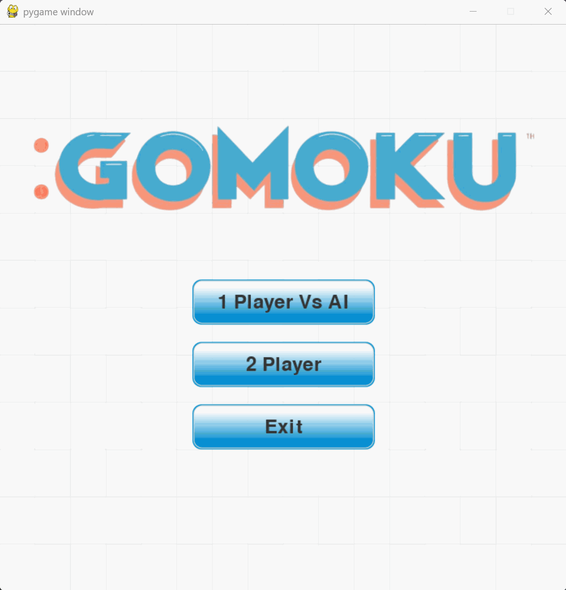

# Gomoku AI - Rapfi Architecture



Dự án game **Gomoku (Cờ Caro)** tích hợp trí tuệ nhân tạo (AI) sử dụng mô hình mạng nơ-ron học sâu (Deep Learning) kết hợp với tìm kiếm cây Monte Carlo (MCTS) cùng giao diện chơi game trên máy tính (Desktop GUI bằng Pygame).

---

## 🔬 Kiến trúc Mô hình AI

Kiến trúc mạng nơ-ron trong dự án này được tham khảo và tùy chỉnh từ bài báo nghiên cứu:
> **"Rapfi: Distilling Efficient Neural Network for the Game of Gomoku" (2025)**

### Điểm nổi bật của kiến trúc:
*   **Directional Convolution (DirConv2d):** Thay vì sử dụng tích chập 2D thông thường, mô hình áp dụng các bộ lọc tích chập định hướng để quét các hàng cờ theo 4 hướng cốt lõi: **Ngang (Horizontal)**, **Dọc (Vertical)**, **Chéo xuôi (Diagonal)**, và **Chéo ngược (Anti-diagonal)**. Điều này giúp mô hình nhận diện cực kỳ hiệu quả các chuỗi cờ liên tiếp đặc trưng của Gomoku.
*   **Residual Blocks & Dual-Heads:** Đặc trưng định hướng sau khi trích xuất được đưa qua các khối ResNet và phân tách thành 2 đầu ra (Dual-Heads):
    *   **Policy Head:** Dự đoán phân phối xác suất của nước đi tiếp theo tối ưu (mảng phẳng 225 phần tử cho bàn cờ 15x15).
    *   **Value Head:** Đánh giá trạng thái bàn cờ hiện tại dưới dạng xác suất Thắng / Hòa / Thua.
*   **Hybrid Backend:** Mã nguồn mô hình sử dụng Keras 3 cấu hình chạy trên nền tảng PyTorch backend (`KERAS_BACKEND=torch`) đem lại khả năng tối ưu hóa cao cho cả việc huấn luyện lẫn suy luận (inference).

---

## 📂 Cấu trúc Thư mục Dự án

```text
Gomoku/
├── assets/                          # Các tài nguyên hình ảnh, âm thanh của game
├── core/                            # Lập trình cốt lõi của game và AI
│   ├── Board.py                     # Logic bàn cờ, kiểm tra chiến thắng
│   ├── AI_agent.py                  # Agent AI thực thi nước đi
│   ├── Rapfi_core.py                # Định nghĩa mô hình Rapfi trên PyTorch
│   └── rapfi_core_tf.py             # Định nghĩa mô hình Rapfi trên Keras 3 (PyTorch backend)
├── Gui/                             # Các thành phần giao diện Pygame (nút bấm, quân cờ)
├── Models/                          # Thư mục lưu trữ trọng số mô hình đã huấn luyện (.pth và .weights.h5)
├── states/                          # Quản lý các trạng thái màn hình game (Menu, PVP, chơi với AI, Game Over)
├── Gomoku_core_update_trained/      # Pipeline huấn luyện, MCTS và API Server
│   ├── backend/                     # FastAPI backend để host mô hình AI qua REST API
│   ├── frontend/                    # Giao diện web client tối giản (HTML/JS)
│   ├── MCTS_policy_only.py          # Tìm kiếm cây Monte Carlo (MCTS) kết hợp Policy Head
│   ├── FastHeuristic7.py            # Hàm heuristic đánh giá nhanh trạng thái bàn cờ
│   └── trainning.py                 # Kịch bản huấn luyện mô hình AI
├── main.py                          # Điểm chạy giao diện Desktop Pygame
├── requirements.txt                 # Danh sách các thư viện cần thiết
└── demo.gif                         # Ảnh động demo trò chơi
```

---

## 🛠️ Hướng dẫn Cài đặt & Khởi chạy

### 1. Chuẩn bị Môi trường ảo (venv)
Mở Terminal tại thư mục gốc của dự án và chạy:

```bash
# Tạo môi trường ảo
python -m venv venv

# Kích hoạt môi trường ảo (Windows - PowerShell)
.\venv\Scripts\Activate.ps1

# Hoặc kích hoạt môi trường ảo (Windows - CMD)
.\venv\Scripts\activate.bat
```

### 2. Cài đặt các Thư viện
```bash
python -m pip install --upgrade pip
pip install -r requirements.txt
```

### 3. Chơi trên Giao diện Desktop (Pygame GUI)
Để chơi trực tiếp trên máy tính với AI hoặc chế độ 2 người chơi cục bộ:
```bash
python main.py
```


## 🎓 Huấn luyện & Dữ liệu

Mô hình AI được huấn luyện bằng phương pháp **Supervised Learning (Học có giám sát)** dựa trên bộ dữ liệu [Gomoku Dataset trên Hugging Face](https://huggingface.co/datasets/Karesis/Gomoku) (được tạo ra thông qua cơ chế tự chơi - Self-play từ công cụ **WinePy**, bản triển khai Python của Wine Gomoku AI). Các tập tin tiền xử lý và tăng cường dữ liệu (Data Augmentation) bằng cách xoay bàn cờ nằm trong thư mục `Gomoku_core_update_trained/`.
